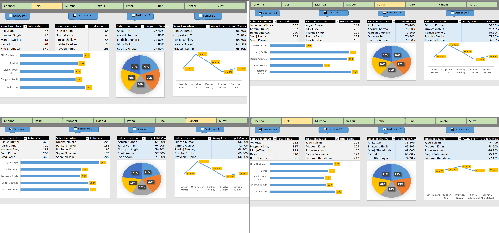
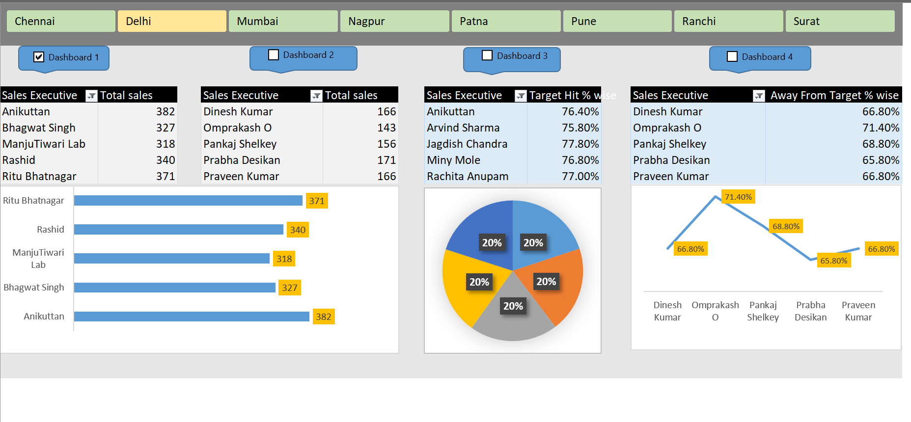
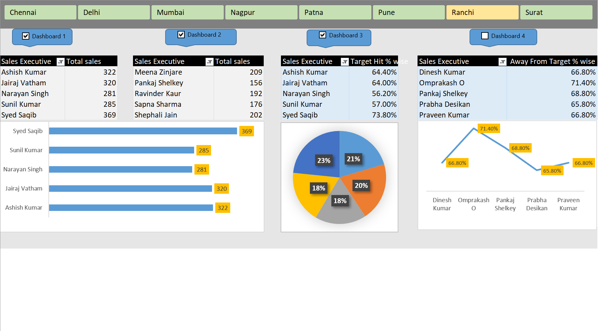
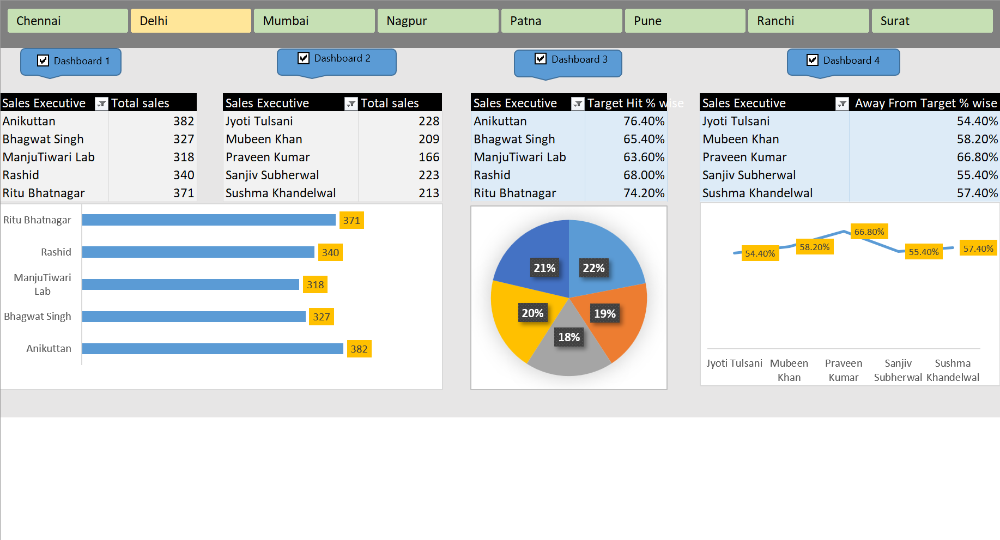

# Sales Performance Dashboard (Excel)

An interactive **Sales Performance Dashboard** built in **Microsoft Excel** using:
- **Pivot Tables**
- **Slicers**
- **Charts (Bar, Line, Pie)**
- **VBA Macros** for navigation across 4 dashboards.

This dashboard provides insights into **sales performance of executives** across various regions, showing KPIs like **Total Sales, Target Hit %, and Away from Target %.**

---

## 📸 Dashboard Overview

---

## 🚀 Key Features
- **4 Interactive Dashboards** (navigable via VBA macro buttons).
- **KPIs Tracked:**
  - Total Sales per Employee.
  - Target vs Achieved (Target = 500).
  - Total Hit %.
  - Away From Target %.
- **Dynamic Filters:** Slicers for region & sales executives.
- **Visualizations:** Combination of bar, line, and pie charts.

---

## 📊 Individual Dashboard Views
### **Dashboard 1**

### **Dashboard 2**

### **Dashboard 3**

### **Dashboard 4**

---

## 🗂 Project Files
- `excel-sales-dashboard.xlsm` — Main Excel dashboard file (with macros).
- `data/raw_data_sample.csv` — Sample raw data (anonymized).
- `assets/` — Screenshots and overview image.

---

## 🧠 What I Learned
- Building **multi-view dashboards** using Pivot Tables and Slicers.
- Automating dashboard navigation with **VBA Macros**.
- Designing KPIs and combining multiple charts for clear storytelling.
- Cleaning and preparing data for Excel-based analysis.

---

## 🔁 How to Use
1. **Download** `excel-sales-dashboard.xlsm`.
2. **Enable Macros** when prompted (for buttons to work).
3. Use slicers and buttons (Dashboard 1–4) to interact with the data.

---

## 📜 License
This project is released under the **MIT License**.

---

## 👤 Author
**Vishwas Mankotia**  
[LinkedIn](https://www.linkedin.com/in/vishwas-mankotia-03771b336)

